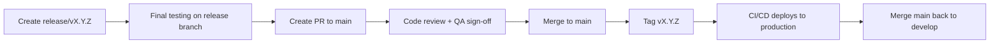

# 12. Release Management

> **Principle**: Ship fast, ship safely. Every release is a promise to users.

---

## 24. Semantic Versioning

### Version Format

```
MAJOR.MINOR.PATCH[-PRERELEASE][+BUILD]

Examples:
1.0.0        # Initial release
1.1.0        # New feature (backward compatible)
1.1.1        # Bug fix
2.0.0        # Breaking change
2.0.0-beta.1 # Pre-release
2.0.0+build.123 # Build metadata
```

### When to Bump

| Change Type                       | Version Bump | Example                |
| --------------------------------- | ------------ | ---------------------- |
| Breaking API change               | MAJOR        | Rename API endpoint    |
| New feature (backward compatible) | MINOR        | Add new status type    |
| Bug fix                           | PATCH        | Fix presence TTL bug   |
| Security patch                    | PATCH        | Fix auth vulnerability |
| Internal refactor                 | PATCH        | No version bump needed |

### DevRadar Components Versioning

| Component         | Versioning Strategy      |
| ----------------- | ------------------------ |
| VS Code Extension | Store requires semver    |
| Backend API       | `/v1/`, `/v2/` in URL    |
| Internal packages | Monorepo sync versioning |
| Database schema   | Migration numbered       |

---

## Release Notes

### Release Notes Template

```markdown
# DevRadar v1.2.0 Release Notes

**Release Date**: 2024-01-15

## 🚀 New Features

- **Ghost Mode**: Watch friends' activity while appearing offline (Pro tier)
- **Spotify Integration**: Show what you're listening to while coding

## 🐛 Bug Fixes

- Fixed issue where presence status would show "offline" after 30s of inactivity
- Corrected leaderboard ranking calculation for timezone edge cases

## ⚡ Performance

- Reduced WebSocket reconnection time by 50%
- Optimized Redis key expiration handling

## 🔐 Security

- Updated OAuth token rotation to use one-time refresh tokens
- Added rate limiting to friend request endpoint

## 💔 Breaking Changes

- None in this release

## ⚠️ Deprecations

- `GET /api/v1/status` deprecated, use `GET /api/v2/presence` instead
  - Will be removed in v2.0.0 (estimated Q2 2024)

## 🙏 Contributors

Thanks to @contributor1, @contributor2 for their contributions!

---

[Full Changelog](https://github.com/devradar/devradar/compare/v1.1.0...v1.2.0)
```

### Changelog Automation

```yaml
# .github/workflows/release.yml
- name: Generate Release Notes
  uses: release-drafter/release-drafter@v5
  with:
    config-name: release-drafter.yml
```

---

## Release Branch Strategy

### Git Flow (Simplified)

```
main ─────●─────●─────●─────●───── (production-ready)
           \         /     /
            \   hotfix    /
             \     │     /
              ─────●────  (hotfix/auth-fix)
                   │
develop ───●───●───●───●───●───── (integration)
            \     /
             ●───● (feature/ghost-mode)
```

### Branch Naming

| Branch Type | Pattern                         | Example                       |
| ----------- | ------------------------------- | ----------------------------- |
| Feature     | `feature/<ticket>-<short-desc>` | `feature/DR-123-ghost-mode`   |
| Bugfix      | `fix/<ticket>-<short-desc>`     | `fix/DR-456-presence-timeout` |
| Hotfix      | `hotfix/<short-desc>`           | `hotfix/auth-token-leak`      |
| Release     | `release/v<version>`            | `release/v1.2.0`              |

### Release Process



---

## Hotfix Process

### When to Hotfix

- Security vulnerability in production
- Critical bug affecting > 20% of users
- Data integrity issue

### Hotfix Workflow

```bash
# 1. Branch from main
git checkout main
git pull origin main
git checkout -b hotfix/auth-token-fix

# 2. Make minimal fix
# Edit files...

# 3. Test thoroughly
npm test
npm run test:e2e

# 4. Create PR to main (expedited review)
gh pr create --base main --title "HOTFIX: Fix auth token leak"

# 5. After merge, tag and deploy
git tag v1.1.1
git push origin v1.1.1

# 6. Merge hotfix to develop
git checkout develop
git merge main
git push origin develop
```

### Hotfix Checklist

- [ ] Minimal change (fix only, no refactoring)
- [ ] Unit tests pass
- [ ] Smoke test on staging
- [ ] Security review (if security-related)
- [ ] At least 1 approver (can be async for SEV-0)
- [ ] Rollback plan documented
- [ ] Monitoring dashboards ready

---

## Feature Deprecation Process

### Deprecation Lifecycle

```
ACTIVE → DEPRECATED → SUNSET → REMOVED
         (6 months)   (1 month)
```

### Step-by-Step Deprecation

#### 1. Mark Deprecated

```typescript
/*** @deprecated Use `getPresenceV2()` instead. Will be removed in v2.0.0 ***/
export const getPresence = async (userId: string): Promise<Presence> => {
  console.warn('getPresence is deprecated. Use getPresenceV2 instead.');
  return getPresenceV2(userId);
};
```

#### 2. Communicate

- Add to release notes
- Email Pro/Team customers
- In-app deprecation banner

#### 3. Add HTTP Warning Header

```typescript
res.setHeader('Warning', '299 - "This API is deprecated. Use /v2/presence instead."');
res.setHeader('Deprecation', 'sun, 01 jan 2025 00:00:00 gmt');
res.setHeader('Link', '</api/v2/presence>; rel="successor-version"');
```

#### 4. Brownout Period

- 1 month before sunset: Fail requests randomly (5%)
- 2 weeks before: Fail 50% of requests
- 1 week before: Fail 90% of requests

#### 5. Remove

- Final removal in next major version
- Return `410 Gone` with migration link

---

## API Sunset Policy

### Sunset Timeline

| API Version | Status     | Sunset Date | Notes  |
| ----------- | ---------- | ----------- | ------ |
| v1          | Deprecated | 2024-06-01  | Use v2 |
| v2          | Current    | -           | -      |

### Breaking Change Policy

- **30 days notice** for security-critical changes
- **90 days notice** for minor breaking changes
- **6 months notice** for major API deprecations

### Sunset Notification

```json
{
  "error": {
    "code": "API_SUNSET",
    "message": "This API version (v1) is no longer supported.",
    "migrationGuide": "https://docs.devradar.io/migration/v1-to-v2",
    "sunsetDate": "2024-01-01"
  }
}
```

---

## End-of-Life (EOL) Announcements

### EOL Template

```markdown
# End of Life: DevRadar VS Code Extension v1.x

**Announcement Date**: 2024-01-01
**End of Support**: 2024-06-01
**End of Life**: 2024-09-01

## What This Means

- **Now until June 1**: Security patches only, no new features
- **June 1 - September 1**: No updates, use at your own risk
- **After September 1**: Extension will stop functioning

## Migration Steps

1. Update to v2.x via VS Code Extensions
2. Re-authenticate with GitHub
3. Review new privacy settings

## Support

Questions? Contact support@devradar.io

---

Thank you for being an early adopter! 💜
```

---

## Feature Flags for Releases

### Gradual Rollout

```typescript
/* LaunchDarkly-style feature flags */
const isFeatureEnabled = async (feature: string, userId: string): Promise<boolean> => {
  const flag = await featureFlags.get(feature);

  if (!flag.enabled) return false;
  /* Percentage rollout */
  if (flag.rolloutPercentage < 100) {
    const hash = hashUserId(userId);
    const bucket = hash % 100;
    return bucket < flag.rolloutPercentage;
  }
  /* Tier-based rollout */
  if (flag.tiers && !flag.tiers.includes(user.tier)) {
    return false;
  }

  return true;
};
```

### Rollout Strategy

| Phase   | Audience         | Duration |
| ------- | ---------------- | -------- |
| Canary  | Internal team    | 1 day    |
| Beta    | Pro users (10%)  | 3 days   |
| Limited | Pro users (50%)  | 3 days   |
| GA      | All users (100%) | -        |

### Emergency Rollback

```bash
# Instant feature disable via API
curl -X POST https://api.devradar.io/admin/feature-flags \
  -H "Authorization: Bearer $ADMIN_TOKEN" \
  -d '{"feature": "spotify_integration", "enabled": false}'
```

---

## Release Metrics

### Quality Gates

| Metric           | Threshold  | Blocks Release |
| ---------------- | ---------- | -------------- |
| Test Coverage    | > 80%      | ✅ Yes         |
| E2E Tests        | 100% pass  | ✅ Yes         |
| Security Scan    | 0 Critical | ✅ Yes         |
| Bundle Size      | < 500KB    | ⚠️ Warning     |
| Lighthouse Score | > 90       | ⚠️ Warning     |

### Post-Release Monitoring

- **Error rate**: Alert if > 1% increase
- **Latency**: Alert if P95 > 200ms
- **User reports**: Monitor support tickets
- **Rollback trigger**: Auto-rollback if error rate > 5%
